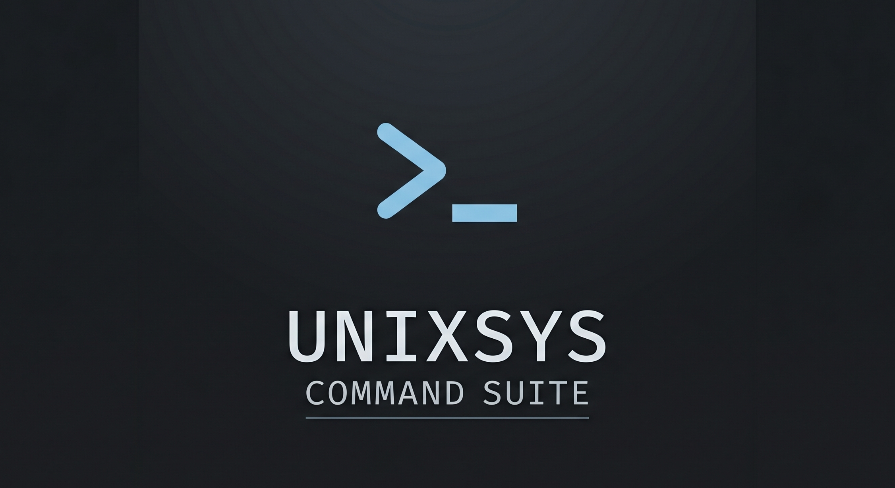

<h1 align="center">
    
</h1>

<h1 align="center">
Unix-Style CLI Command Suite
</h1>

<p align="center">
  <i>A collection of Unix-style command line utilities implemented from scratch in C using POSIX APIs and Linux system calls.</i>
</p>

<h4 align="center">
  
  
  
  
  
  
  
  
</h4>

---

# Introduction

Unix-Style CLI Command Suite is a systems programming project focused on recreating core Unix command-line utilities from scratch in pure C.

The project demonstrates practical understanding of:

- POSIX-compliant programming
- Linux system calls
- Low-level file I/O
- Process management
- Directory traversal
- UNIX internals
- File descriptor handling

All commands are implemented and tested in a Linux development environment using GCC and standard POSIX APIs.

---

# Implemented Commands

| Command | Description |
|---|---|
| `ls` | List directory contents |
| `cp` | Copy files |
| `cat` | Display file contents |
| `mv` | Move or rename files |
| `pwd` | Print current working directory |
| `rm` | Remove files |
| `touch` | Create empty files |
| `stat` | Display file metadata |
| `uname` | Display system information |

> Additional commands and features are continuously being improved.

---

# Core Concepts Used

- Linux System Calls
- POSIX APIs
- File Descriptors
- Process Lifecycle
- Buffer Management
- Directory Handling
- Low-Level I/O
- Error Handling using `errno`

---

# System Calls Used

```c
open()
read()
write()
close()
stat()
opendir()
readdir()
fork()
exec()
wait()
```

---

# Project Structure

```bash
Linux_Commands/
├── src/
│   ├── cmd_cat.c
│   ├── cmd_cd.c
│   ├── cmd_cp.c
│   ├── cmd_ls.c
│   ├── cmd_ls_opt.c
│   ├── cmd_mv.c
│   ├── cmd_pwd.c
│   ├── cmd_rm.c
│   ├── cmd_stat.c
│   ├── cmd_stat_opt.c
│   ├── cmd_touch.c
│   └── cmd_uname.c
│
├── bin/
│   ├── cat
│   ├── cd
│   ├── cp
│   ├── ls
│   ├── mv
│   ├── pwd
│   ├── rm
│   ├── stat
│   ├── stat_opt
│   ├── touch
│   └── uname
│
├── tests/
│   ├── abc.txt
│   ├── xyz.txt
│   └── info.txt
│
├── assets/
│   └── logo.png
│
├── Makefile
└── README.md
```

---

# Building the Project

## Clone the repository

```bash
git clone https://github.com/BitManipulator-cyber/YOUR_REPO.git
cd YOUR_REPO
```

---

## Compile commands

```bash
gcc src/cmd_ls.c -o bin/ls
gcc src/cmd_cp.c -o bin/cp
gcc src/cmd_cat.c -o bin/cat
```

Or compile everything using:

```bash
make
```

---

# Running Commands

```bash
./bin/ls
./bin/cat tests/info.txt
./bin/cp tests/abc.txt tests/xyz.txt
```

---

# Development Environment

| Component | Details |
|---|---|
| OS | Linux |
| Compiler | GCC |
| Standard | POSIX |
| Shell | Bash |

---

# Future Improvements

- Custom Unix shell integration
- Pipe and redirection support
- Signal handling
- Thread-based utilities
- Improved command option parsing
- Shared utility library for reusable functions

---

# Learning Outcomes

This project helped strengthen understanding of:

- Linux internals
- Systems programming
- UNIX architecture
- Kernel-user space interaction
- Low-level debugging
- Process and memory concepts

---

# License

This project is licensed under the MIT License.
